# DevFrame Design System & Specifications

This document defines the visual design system, type tokens, UI components, surface modes, and template specification standards for **DevFrame**.

---

## 1. Product Feel & Creative Direction

DevFrame is designed to read like a polished developer tool and professional portfolio publisher rather than a generic theme marketplace. The design architecture is built around three core pillars:

- **Dark-First Shell**: Lean into deep, rich, low-light environments (anthracite, slate, obsidian) with warm, premium metallic and glowing accents.
- **Calm & High-Density UI**: Interface surfaces inside operational flows (Builder, Dashboard, Studio) should prioritize data density, crisp borders, and calm transitions over flashy marketing effects.
- **Editorial Accentuation**: Keep public and landing pages expressive, utilizing high-contrast typography and subtle motion without losing the tool-centric visual grounding.

---

## 2. Typography Stack

We enforce a strict distinction between editorial, operational, and metadata typography to maintain structure.

| Type Classification | Font Family | Usage Guidelines | CSS Variables / Classes |
| :--- | :--- | :--- | :--- |
| **Sans / Body** | `Manrope`, sans-serif | Primary sans-serif font for UI elements, labels, marketing copy, and descriptions. | `font-sans` |
| **Mono / Metadata** | `IBM Plex Mono`, monospace | Used strictly for routes, statistics, technical stacks, badges, and small metadata. | `font-mono` |

### Eyebrow & Badging Pattern
To prevent decorative drift, helper labels and eyebrow text should always use uppercase text, small font sizes, wide tracking, and rounded silhouettes (e.g., standardizing on `.section-label` or the `Badge` component).

---

## 3. Global Color System

Global color styles are configured in `src/app/globals.css` and use Tailwind CSS v4 custom variables. **The legacy green-first "Supabase" look is deprecated.** DevFrame is now centered on dark slate neutrals and warm metallic tones.

### Light Mode Tokens
- **Background**: `#ffffff` (Primary page background)
- **Background Alt**: `#fafafa` (Secondary block background)
- **Surface**: `#f4f4f5` (Standard cards and dropdowns)
- **Surface Strong**: `#e4e4e7` (Focused borders, highlights, and inline tags)
- **Border**: `#e4e4e7` (Low-contrast separation lines)
- **Accent**: `#b48e4b` (Classic warm gold / primary actions)
- **Accent Strong**: `#8f6e33` (Hover and high-visibility labels)
- **Accent Soft**: `#fdfaf2` (Subtle highlight fills)

### Dark Mode Tokens (Primary Theme)
- **Background**: `#0f0f0f` (Obsidian / absolute page background)
- **Background Alt**: `#0a0a0a` (Secondary layout boundaries)
- **Surface**: `#161616` (Deep glass surfaces and inputs)
- **Surface Strong**: `#1e1e1e` (Buttons, overlays, and secondary CTAs)
- **Border**: `#222222` (Sleek dark panel division lines)
- **Accent**: `#c9a96e` (Polished gold / primary brand accents)
- **Accent Strong**: `#e2c488` (Glowing active elements)
- **Accent Soft**: `#1e1a12` (Low-opacity golden focus backgrounds)

---

## 4. Shared UI Primitives

### Buttons
All buttons must inherit from `src/components/ui/button.tsx`.
- **Variants**: `default`, `secondary`, `accent` (primary golden theme), `ghost` (nav and tabs), `outline`.
- **Sizes**: `xs`, `default`, `sm`, `lg`, `icon`.
- **Guideline**: Use `accent` for high-importance workflows. Never use custom colored inline classes for standard actions.

### Cards
Card surfaces inherit style behaviors from `src/components/ui/card.tsx`.
- **Primary Design Style**: Large rounding (`rounded-[28px]`), subtle glowing dark/light borders, vertical gradient overlays, soft low-frequency shadows, and backdrop-blur layers on large responsive panels.
- **Nested Elements**: Internal statistic boxes or status blocks step down to `rounded-2xl` or `rounded-[20px]` to maintain correct nested ratios.

### Badges & Section Labels
Badges utilize `src/components/ui/badge.tsx` with preset states (`default`, `success`, `warning`). Section headers use a `.section-label` class featuring `uppercase text-[10px] tracking-[0.24em] font-semibold`.

---

## 5. Surface Modes

DevFrame splits into four operational zones, each with unique density rules:

```mermaid
graph TD
    A[DevFrame Workspace] --> B[Marketing / Landing]
    A --> C[Builder / Dashboard]
    A --> D[Studio Flow]
    A --> E[Public Portfolios]
    
    style B fill:#1e1a12,stroke:#c9a96e,stroke-width:2px
    style C fill:#161616,stroke:#222222,stroke-width:2px
    style D fill:#0a0a0a,stroke:#c9a96e,stroke-width:2px
    style E fill:#0f0f0f,stroke:#222222,stroke-width:2px
```



### Marketing (`/`, `/templates`, `/support`)
- Expressive headers, perspective cards, subtle GSAP entry animations.
- Highlight features through real product components instead of abstract graphic placeholders.

### Dashboard & Builder
- Compact operational density.
- Structured bands: summaries on top, setup status indicators, and modular input clusters.

### Studio (`/studio`)
- Minimalist app shell designed for deep focus.
- Dual-column fixed layout showing code/controls on one side and a fully dynamic interactive preview on the other.
- No heavy decorative assets; utility header with instant responsive toggles.

### Auth (`/sign-in`, `/sign-up`)
- Uses route-local custom authentication components in `@/components/auth` rather than standard Clerk widgets.
- Styled to blend perfectly with the dark slate neutrals of the app shell, incorporating icon-led inputs, robust OAuth controls, and fallback states.

---

## 6. Template System Specifications & Registry

Every portfolio template resides under `src/templates/<slug>` and registers itself dynamically to `src/templates/registry.ts`. Below are the complete specifications, variable overrides, and dynamic schema settings for each template.

---

### A. Nova Template (`src/templates/nova`)
A clean, minimal, center-aligned template utilizing large gradient typographic headings, side-by-side bio splits, and card highlights. Ideal for creative frontend developers and engineers emphasizing single projects.

- **Layout Structure**: 
  - Centered Hero with transparent gradient title masking.
  - Two-column split for Bio/Skills vs. Large Highlight Project.
  - Asymmetric rows for Resume details and chronological Experience items.
- **Typography & Details**:
  - Focuses on crisp, light/dark transition timings.
  - Custom pill-shaped action badges.
- **Dynamic CSS Properties**:
  - `--nova-bg`: Background color (Dark: `#0f0f0f`, Light: `#ffffff`)
  - `--nova-surface`: Glass overlays (Dark: `#161616`, Light: `#f4f4f5`)
  - `--nova-accent`: Highlight text & actions (Dark: Custom/`#c9a96e`, Light: Custom/`#b48e4b`)
- **Supported `templateSettings` Options**:
  ```typescript
  type NovaSettings = {
    defaultMode?: "dark" | "light"; // Primary starting theme state
    heroTagline?: string;           // Custom subtitle below Name/Title
    accentColor?: string;           // Hex code custom accent theme overrides
  };
  ```

---

### B. Vertex Template (`src/templates/vertex`)
A high-density, bento-grid based layout inspired by professional engineering portfolios. Designed to pack rich developer metadata, verification marks, and external credentials into a beautiful dashboard block view.

- **Layout Structure**:
  - Header band with Profile Image, Status Subtitle, Map Pin, and Verification indicator.
  - Six-column responsive Bento Grid containing:
    - Large *About* block.
    - Two-column tall *Experience* timeline.
    - Compact *Professional Resume* widget with deep stat summaries.
    - Custom *Tech Stack* label cluster.
    - Horizontal block of *Recent Projects*.
    - Media *Gallery* carousel.
- **Visual Styles**:
  - Explicit glassmorphism cards with `backdrop-blur-md` and shadow bounds.
  - Custom theme switches with micro-icon animations (Sun/Moon sliders).
- **Dynamic CSS Properties**:
  - `--vertex-root-bg`: Main canvas color (Dark: `#090a0f`, Light: `#f8fafc`)
  - `--vertex-bg`: Bento block canvas (Dark: `rgba(22, 24, 33, 0.7)`, Light: `rgba(255, 255, 255, 0.95)`)
  - `--vertex-border`: Glowing divider (Dark: `rgba(255, 255, 255, 0.06)`, Light: `rgba(15, 23, 42, 0.06)`)
  - `--vertex-accent`: Main block highlights (Dark: `#6366f1`, Light: `#4f46e5`)
- **Supported `templateSettings` Options**:
  ```typescript
  type VertexSettings = {
    defaultMode?: "dark" | "light";      // Initial theme mode
    yearsOfExperience?: string;          // Numeric badge display inside Resume block
    openSourceStars?: string;            // Showcase total project star count
    showVerifiedBadge?: boolean;         // Toggles the glowing verification checkmark
  };
  ```

---

### C. Drift Template (`src/templates/drift`)
A sophisticated, modern split-column portfolio styled for tech leaders and specialized backend/frontend engineers. Uses a sticky primary side panel with dynamic page scroll indicators and responsive side cards.

- **Layout Structure**:
  - **Left Side Panel (Sticky)**: Floating container with bold developer identity, dynamic jump-link indicator (animating lines that expand on hover), and unified social connections.
  - **Right Side Panel (Scrollable)**: Assembling About details, high-opacity Experience cards, Recommendation blocks, Resume stats, Projects, and customizable Gallery tiles.
- **Motion & Micro-interactions**:
  - High-precision CSS line transitions inside navigation anchors.
  - Fluid parent-child opacity shifts in list view groups (`group-hover/list`).
- **Dynamic CSS Properties**:
  - `--drift-bg`: Main side canvas (Dark: `#0f172a`, Light: `#f8fafc`)
  - `--drift-heading`: Typography colors (Dark: `#e2e8f0`, Light: `#0f172a`)
  - `--drift-accent`: Active navigation & hover states (Dark: Custom/`#5eead4`, Light: Custom/`#0d9488`)
  - `--drift-hover`: Interaction overlay card (Dark: `rgba(30, 41, 59, 0.5)`, Light: `rgba(241, 245, 249, 0.8)`)
- **Supported `templateSettings` Options**:
  ```typescript
  type DriftSettings = {
    defaultMode?: "dark" | "light";      // Theme switch setting
    sidebarTagline?: string;             // Custom text shown directly under title
    accentColor?: string;                // Hex code override for badges/links
  };
  ```

---

## 7. Motion & Animation Standards

- **Promotion vs. Operation**: Use GSAP or Framer Motion strictly on marketing homepages or entrance overlays. Inside the Builder or Studio, favor raw, high-performance CSS transitions (`transition-all duration-300`).
- **Interactive States**: Hover actions should feel snappy but smooth (e.g., translation offsets `hover:-translate-y-0.5`, subtle scaling, or opacity transitions).
- **Reduced Motion**: Respect system preferences by ensuring any heavy canvas elements or page-long triggers support the standard `motion-reduce` CSS media selectors.

---

## 8. Development & Architectural Guardrails

1. **No Table Sprawl**: Do not create unique database tables per-template. Store template variables cleanly using `templateSettings` JSON fields.
2. **Keep the Shell Consistent**: The global navigation, authentication shell, and footer wrapper are template-agnostic. Design details belong *inside* the portfolio presentation layers, not the surrounding site shell.
3. **No Branded Regressions**: Do not reintroduce the obsolete bright green color palette into the global app core.
4. **Fallback Resilience**: Ensure every template renders seamlessly in "Demo Mode" if Supabase database links or Clerk keys are missing. Use stable fallback values for all profile images, projects, and gallery listings.
